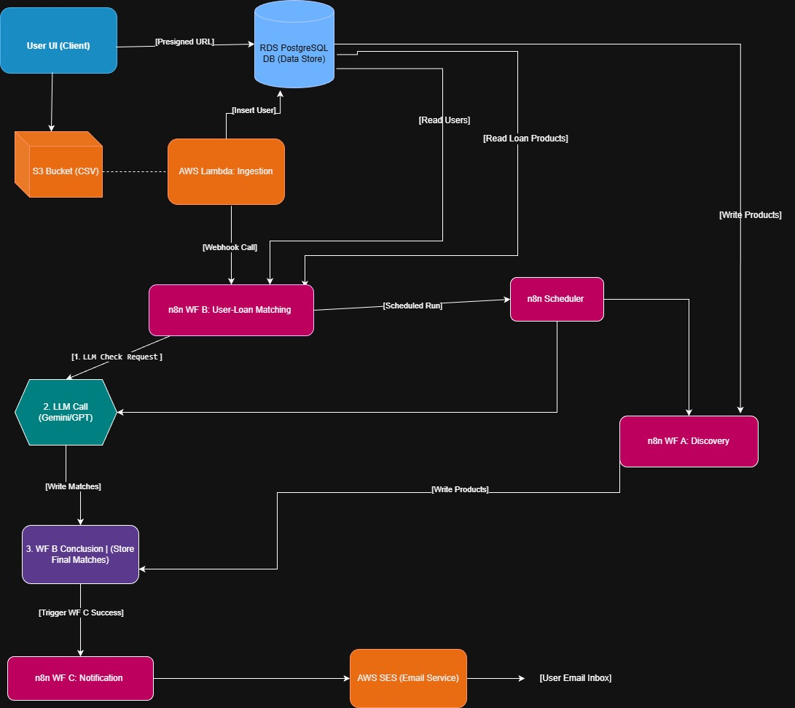
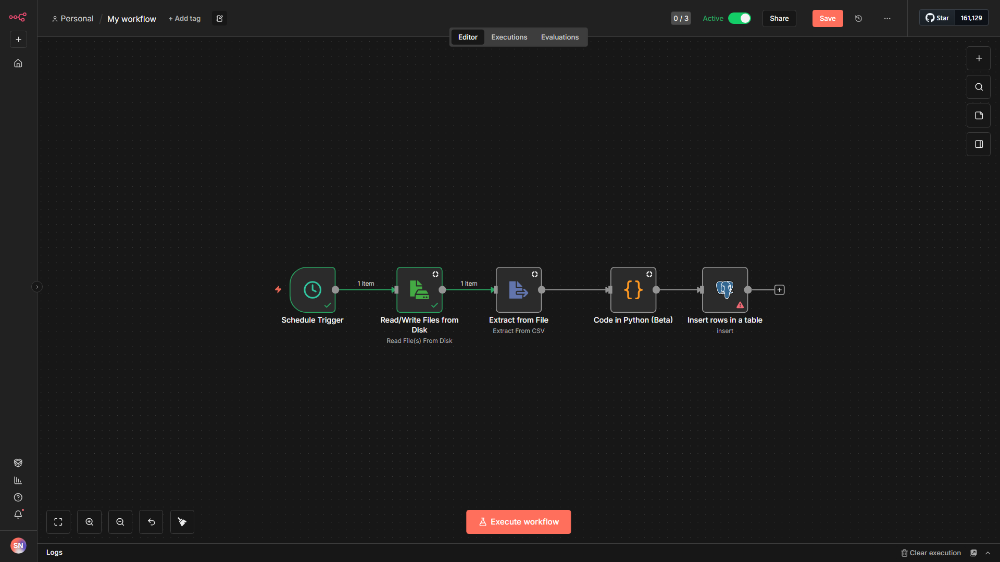

# Suvroneel Nathak — The Loan Eligibility Engine

This repository contains my submission for the **SDE Intern (Backend)** assignment.  
It showcases a backend pipeline that ingests user CSVs, discovers relevant loan products, 
matches users to eligible loans based on rules, and triggers notifications.

The solution is implemented using n8n automations, Docker, Python, and a structured SQL schema.  
AWS services are prepared for deployment but are optional for local testing.

---

## 📁 Repository Structure

- `lambdas/` – AWS Lambda functions (presigned URL generator, S3 CSV processor)
- `infra/` – Serverless Framework configuration and infra notes
- `n8n/` – n8n workflow JSONs + docker-compose setup
  - `n8n/workflows/user_loan_workflow.json` – exported n8n workflow
- `ui/` – Minimal UI for uploading CSV files
- `sql/` – Database schema, seed queries, helper queries
- `docs/` – Architecture diagram, workflow screenshot, design decisions, and deployment notes

---

## 🏗️ Architecture Diagram



---

## 📊 n8n Workflow

The automation workflow is built in n8n.  
- **Screenshot:**  
    
- **Workflow JSON:**  
  `n8n/workflows/user_loan_workflow.json`

The workflow includes the following nodes in order:  
1. **Schedule Trigger** – triggers workflow at defined intervals  
2. **Read from Disk** – reads the uploaded CSV file  
3. **Extract from File** – converts CSV data into JSON format  
4. **Code (Python) Node** – processes user data for loan eligibility logic  
5. **PostgreSQL (Insert Rows) Node** – inserts processed data into database tables

---

## 🚀 Quick Start (Local Development)

1. **Start PostgreSQL locally:**
   ```bash
   docker run --name loan-postgres \
     -e POSTGRES_PASSWORD=postgres \
     -e POSTGRES_DB=loan_db \
     -p 5432:5432 \
     -d postgres:15
